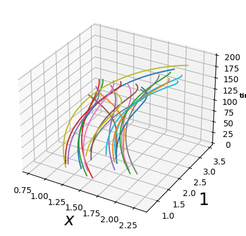
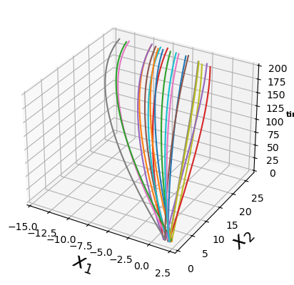
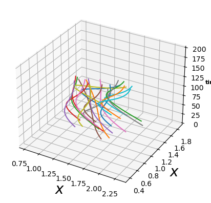
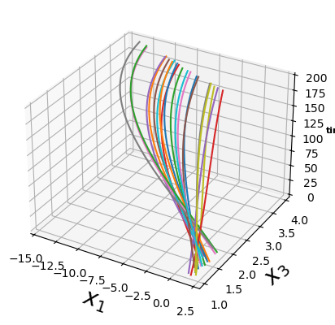
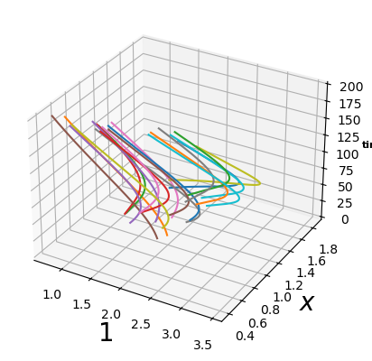
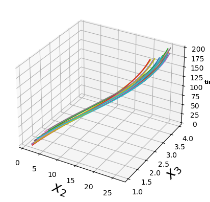

## System Dynamics and Constraints

Let the system state be

$$
s_t =
\begin{bmatrix}
x_t \\
y_t \\
z_t
\end{bmatrix},
$$

where \( (x_t, y_t, z_t) \) correspond to the variables \((x1, x2, x3)\) at time \(t\).

### Constants

$$
\begin{aligned}
dt &= 0.1, \\
v_e &= 1.0, \\
v_p &= 1.5, \\
\omega_e &= 0.1, \\
\omega_p &= 0.2.
\end{aligned}
$$

### Discrete-Time Dynamics

$$
\begin{aligned}
x_{t+1} &= x_t + dt\,\big(-v_e + v_p \cos(z_t) + \omega_e\, y_t\big) + \varepsilon_{x,t}, \\
y_{t+1} &= y_t + dt\,\big(v_p \sin(z_t) - \omega_e\, x_t\big) + \varepsilon_{y,t}, \\
z_{t+1} &= z_t + dt\,\big(\omega_p - \omega_e\big) + \varepsilon_{z,t}.
\end{aligned}
$$

### Constraints

$$
\begin{aligned}
x_t &\in [-5,\, 5], \\
y_t &\in [-5,\, 5], \\
z_t &\in [-\pi,\, \pi].
\end{aligned}
$$

## System Behavior

```bash
python3 posto.py behavior --log=logs/modeltest.lg --state=xyz --init="[[1, 2], [1, 2], [1, 2]]" --timestamp=200 --sta--mode=ann --model_path=home/prachi-bhattacharjee/DNN_test/MyModel2.h5
```

#### Example Results vs In Equation Mode

<p align="center">
  
    
</p>


<p align="center">
    
    
</p>

<p align="center">
  
  
</p>


## Generate Log

```bash
python3 posto.py generateLog --log=/home/prachi-bhattacharjee/Posto/logs/modeltest.lg --states=xyz --init="[[0.1, 0.2],[0.1,0.2],[0.1, 0.2]]" --timestamp=200 --mode="ann" --model_path=/home/prachi-bhattacharjee/DNN_test/MyModel.h5 --prob=3 --dtlog=0.2
```

#### Example Results

Included the .lg in the zip. Due to the high difference in the first few predictions and the last few by the .h5 model, the plots are not visible. 