# `Posto` 

<p align="center">
  
</p>

## About The Tool

With the increasing autonomous capabilities of cyber-physical systems, the complexity of their models also increases significantly, thus continually posing challenges to existing formal methods for safety verification. In contrast to model checking, monitoring emerges as an effective lightweight, yet practical verification technique capable of delivering results of practical importance with better scalability. Monitoring involves analyzing logs from an actual system to determine whether a specification (such as a safety property) is violated.  Although current monitoring techniques work well in some areas, it has largely been unable to cope with the growing complexity of the models. Monitoring techniques, such as those using reachability methods, may fail to produce results when dealing with complex models like Deep Neural Networks (DNNs). We propose here a novel statistical approach for monitoring that is able to generate results with high probabilistic guarantees. 

`Posto` is a Python-based prototype tool that implements the proposed statistical monitoring technique, enabling an effective monitoring of complex systems, including non-linear systems with DNN-based components, while providing results with high probabilistic guarantees.

`Posto` provides three main command-line operations:

1. `behavior` – draw multiple random trajectories and visualise system evolution under uncertainty.
2. `generateLog` – simulate one trajectory, probabilistically sample it, and save it as a `.lg` log for later analysis.
3. `checkSafety` – verify whether logged trajectories satisfy user-defined safety constraints.

`Posto` supports three model types:

- `Equation mode` – update equations supplied through a JSON model.  

- `ANN mode` – system dynamics represented by a trained `.h5` neural network model.

- `Development mode (dev)` – supply a custom Python `getNextState` function without modifying core files.


  

## Installation

The tool can be used in one of two ways: **(1) Local installation (Linux & MacOS)** or **(2) Using Virtual Box (Windows, Linux and MacOS)** using the provided OVA file. The detailed steps for each option are outlined below.

### 1. Local Installation (Recommended for Linux & MacOS)

*This option works on both Linux and MacOS. We provide Ubuntu-specific commands below; MacOS users can typically use the corresponding standard equivalents.*

#### Dependencies

- [`Python 3.9.x`](https://www.python.org/)

  - To install this on Ubuntu, one can follow the following steps (note: this step requires the user to have `sudo` privileges):

    ```bash
    sudo apt update
    sudo apt install python3.9 python3.9-venv python3.9-dev -y
    ```

- [`NumPy`](https://numpy.org/)

  ```bash
  pip install numpy
  ```

- [`SciPy`](https://scipy.org/)

  ```bash
  pip install scipy
  ```

- [`mpmath`](https://mpmath.org/)

  ```bash
  pip install mpmath
  ```

- [`mpl_toolkits`](https://matplotlib.org/2.2.2/mpl_toolkits/index.html)

  ```bash
  pip install matplotlib
  ```

- [`tqdm`](https://pypi.org/project/tqdm/2.2.3/)

  ```bash
  pip install tqdm
  ```

- [`TensorFlow`](https://www.tensorflow.org/) (required for ANN mode)

  ```bash
  pip install tensorflow
  ```

- [`docopt`](https://pypi.org/project/docopt/) (for command-line argument parsing)

  ```bash
  pip install docopt
  ```

**Verify Installation (optional)**

* To verify if the above dependencies are correctly installed, one can run the following:

  ```bash
  python -c "import numpy, scipy, mpmath, tqdm, mpl_toolkits, tensorflow, docopt; print('All dependencies installed successfully')"
  ```

* If all the dependencies are correctly installed, the above command should run without any error, and display `All dependencies installed successfully` in the terminal.

#### Downloading the tool

1. Once the dependencies are installed, download the repository to your desired location `/path/to/Posto`

2. Once the repository is downloaded, the user needs to set the variable `POSTO_ROOT_DIR=` to `/path/to/Posto`. To do so, we recommend adding this to `bashrc` (see **Step 2.1**). For users who do not wish to add it to their `bashrc`, can set the variable each time they open the terminal session to run the tool (see **Step 2.2**). Users choosing step 2.2 are gently reminded to perform this step every time they intend to run the tool.

   1. ***[Recommended]*** Once the repository is downloaded, please open `~/.bashrc`, and add the line `export POSTO_ROOT_DIR=/path/to/Posto`, mentioned in the following steps:

      1. ```shell
         vi ~/.baschrc
         ```

         1. Note for MacOS: Depending on the shell being used, the equivalent configuration file may be `~/.bash_profile` or `~/.zshrc`.

      2. Once `.bashrc` is opened, please add the location, where the tool was downloaded, to a path variable `POSTO_ROOT_DIR` (This step is crucial to run the tool):
   
         1. ```shell
            export POSTO_ROOT_DIR=/path/to/Posto
            ```

   2. *[Alternate Approach]* Run this command every time a new terminal session is opened to run the tool:
   
      1. ```shell
         export POSTO_ROOT_DIR=/path/to/Posto
         ```

### 2. Using Virtual Box (for Windows, Linux, MacOS)

This artifact is distributed as a pre-configured VirtualBox virtual machine to ensure full reproducibility of the experimental results reported in the paper.

1. Install Oracle VirtualBox (version 7.0 or later) from the official website: [virtualbox.org/wiki/Downloads](https://www.virtualbox.org/wiki/Downloads). Please ensure that the **VirtualBox Extension Pack** corresponding to the same version is also installed.
   1. Depending on the OS you are using, please download the VirtualBox accordingly. Once the VirtualBox is setup correctly on your OS, the below steps should be the same. Note the `.ova` file itself will be using Ubuntu.

2. Download the Posto zip from the following link and unzip the contents:
   
   **Intel / AMD (x86_64)** - https://alabama.box.com/s/037ykn3p6w9zhlnwr38sq7uzi6sivxfp. On [Zenodo](https://zenodo.org/records/18233568), this file is provide in the `VirtualBox` folder. Note that the size of the file is over 13GB, so kindly account for that download time.
   
   **Apple Silicon (ARM64)** - https://alabama.box.com/s/1mxsxgoxlpqdjnku3dvdvwuxi5nb9629. Note that the size of the file is over 6GB, so kindly account for that download time.

4. Open **VirtualBox Manager**

5. Select **File → Import Appliance**

6. Choose the downloaded `.ova` file from the unzipped contents

7. Click **Next**, then **Import**

8. Start the imported virtual machine.

9. Use password: **posto123** to log in.
   
   **NOTE:** The password is the same for both the virtual machines.

No additional configuration or installation is required.

#### Posto Location inside the Virtual Machine

After logging into the virtual machine, the Posto tool is located at:

```bash
~/Desktop/Posto
```

To access it, open a terminal and run:

```bash
cd ~/Desktop/Posto
```

From this directory, all commands described in the paper and appendices (including artifact evaluation scripts) can be executed directly.

## Recreating Results

The results to be reproduced are described in the [draft](https://github.com/autmn-lab/posto_tool/blob/master/docs/draft.pdf). Detailed instructions for recreating these results are provided in **Appendices A and B** (originally proposed in [this paper](https://dl.acm.org/doi/10.1007/978-3-031-95497-9_7))

### Jet Model

The main results of the Jet Model study are shown in **Figures A.2 and A.3** in the above draft.

Once the tool is downloaded and properly set up, these experimental results can be reproduced using the [`artEval.py`](https://github.com/autmn-lab/posto_tool/blob/master/artEval.py) script. Detailed steps are provided in **Appendix A**. 

_(Estimated time: 2-15 mins)_

For example, to recreate the result shown in **Figure A.2a** (and similarly **Figures A.2b, A.2c, …, A.3c, and A.3d**), execute the following command:

```bash
python artEval.py --fig=A2a
```

### Van der Pol Oscillator

The main results of the Van der Pol Oscillator study are shown in **Figure A.4** in the above draft.

The experimental results for the Van der Pol Oscillator can be reproduced in a manner similar to the Jet Model case study. Detailed steps are provided in **Appendix A**.

_(Estimated time: 30 mins)_

For example, to recreate the result shown in **Figure A.4a**, execute the following command:

```bash
python artEval.py --fig=A4a
```

### Mountain Car

We also present additional experiments using a DNN-based controller for the Mountain Car benchmark (details in **Appendix B**).

_(Estimated time: 30 mins)_

```bash
python artEvalNN.py --fig=B6a
python artEvalNN.py --fig=B6b
python artEvalNN.py --fig=B6c
python artEvalNN.py --fig=B6d
```

**NOTE:** For each state variable, Posto plots the evolution of that state with time, so running the commands for Figures A.3, A.4 and B.6 will also produce plots for additional state variables not shown in the manuscript. These follow the same interpretation as the shown figure, just for a different state, and can be closed to move on to the next plot.

Step-by-step instructions to recreate the results can also be found [here](https://github.com/autmn-lab/posto_tool/blob/master/docs/recreating_results.md).

## Other Usage: Command-Line

All operations use:
```
python posto.py <operation> [arguments]
```

| Argument                       | Required In                                                | Description                                                  |
| ------------------------------ | ---------------------------------------------------------- | ------------------------------------------------------------ |
| `--log=<directory or logfile>` | `behavior`, `generateLog`, `checkSafety`                   | **Behavior:** path to a **directory** where plots will be saved; an `img/` folder is created inside it.  **GenerateLog / CheckSafety:** path to the **.lg logfile** to write or read; plots are saved in an `img/` folder next to the logfile. |
| `--init=<initialSet>`          | `behavior`, `generateLog`                                  | Initial set for state sampling, e.g., `"[0.8,1],[0.8,1]"`. One `[lo, hi]` pair per dimension. |
| `--timestamp=<T>`              | `behavior`, `generateLog`                                  | Time horizon for the simulation (integer ≥ 0).               |
| `--mode=<mode>`                | All commands                                               | Specifies model type:  • `equation` — load system from a JSON equation model  • `ann` — load system from a `.h5` neural network model |
| `--model_path=<model_path>`    | All commands                                               | Path to model file. Use `.json` for equation mode and `.h5` for ann mode. |
| `--prob=<prob>`                | `generateLog`                                              | Logging probability per step during log generation (float ≥ 0). |
| `--dtlog=<dtlog>`              | `generateLog`                                              | Time interval between logged entries when generating a log (float ≥ 0). |
| `--states=<states>`            | Optional in equation mode; required in ann mode            | Comma-separated list of state variable names. Needed for mapping ANN inputs/outputs. |
| `--constraints=<constraints>`  | Required in `checkSafety` for ann mode; optional otherwise | Safety constraint specification (JSON file or inline list).  |

### 1. Behavior Mode

Generate random trajectories and visualise projections.

```
posto.py behavior \
    --log=<directory> \
    --init=<initialSet> \
    --timestamp=<T> \
    --mode=<mode> \
    --model_path=<model_path> \
    [--states=<states>]
```

###  2. Generate Log

Simulate a single trajectory, apply probabilistic sampling, and store it in a .lg file.

```
posto.py generateLog \
    --log=<logfile> \
    --init=<initialSet> \
    --timestamp=<T> \
    --mode=<mode> \
    --model_path=<model_path> \
    --prob=<prob> \
    --dtlog=<dtlog> \
    [--states=<states>]
```

###  3. Check Safety

Evaluate whether logged trajectories satisfy constraints.

```
posto.py checkSafety \
    --log=<logfile> \
    --mode=<mode> \
    --model_path=<model_path> \
    [--states=<states>] \
    [--constraints=<constraints>]
```

#### Illustrative Example
##### Jet Model
The Jet model is a Moore-Greitzer model of a jet engine compressor which has a stabilizing feedback control, operating in the no-stall mode. It describes the shifted mass flow rate through the compressor (x) and the shifted pressure rise (y)  across it. The discretized dynamics are given as follows:

$$
x_{k+1} = x_k + \Delta t \left( -y_k - 1.5x_k^2 - 0.5x_k^3 - 0.5 \right) + \epsilon
$$

$$
y_{k+1} = y_k + \Delta t \left( 3x_k - y_k \right) + \epsilon
$$

where 

$x = \mathcal{X} - 1$, 

$y = \mathcal{Y} - \mathcal{Y}_{co} - 2$, 

Here, $\mathcal{X}$ and $\mathcal{Y}$ are the mass flow and air pressure rise through the compressor, respectively, $\mathcal{Y}_{co}$ is a constant equal to the pressure rise at zero mass flow and $\epsilon$ is the bounded environmental uncertainty on $x$ and $y$ which is sampled uniformly at every time step and models the disturbances that are not captured by the dynamics.

The following diagram shows how Posto works to monitor these dynamical systems.

<p align="center">
  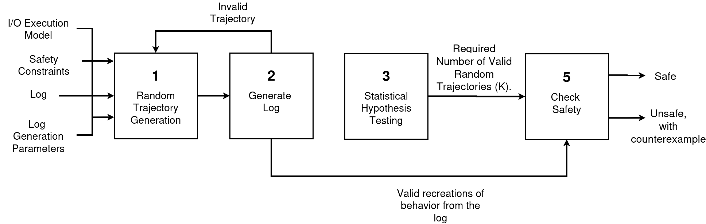
</p>

###### JSON Representation (I/O Execution Model + Safety Constraints)

The Jet model is specified in a JSON file in which the state variables, noise, dynamics, and safety constraints are encoded as follows: 

<p align="center">
  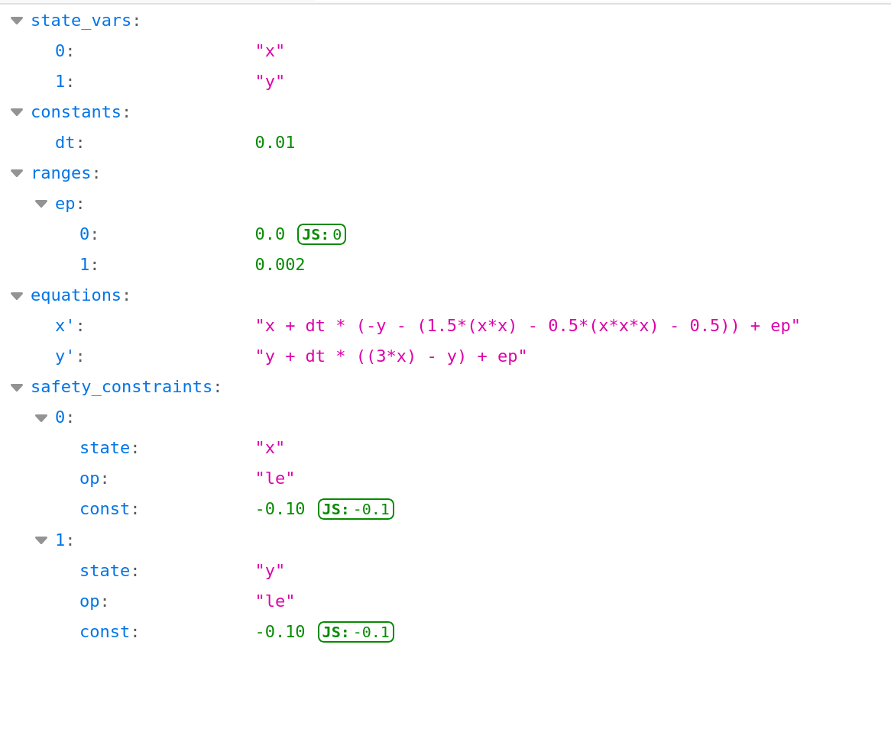
</p>

- `state_vars`: the state variables $x$ and $y$. 

- `constants`: fixed values used in the equations, here the time step `dt` ($\Delta t = 0.01$). 

- `ranges`: the noise variable `ep`, which represents the environmental uncertainty $\epsilon$. A random value of `ep` is drawn uniformly from $[0, 0.002]$.

-  `equations`: the update rule for each state. The primed name (`x'`, `y'`) denotes the value at the next time step ($x_{k+1}$, $y_{k+1}$). 

-  `safety_constraints`: the list of unsafe conditions, each defined by 

  - `state`: the monitored state variable

  -  `op`: the comparison operator, one of `ge` ($\geq$), `le` ($\leq$), `gt` ($>$), or `lt` ($<$)

  - `const`: the threshold. 

    The two entries encode $x \leq -0.10$ and $y \leq -0.10$. A trajectory is unsafe if any entry holds at any time step.


**System Behavior**

The `behavior` command samples initial states uniformly from the initial set $x, y \in [0.8, 1.0]$ and simulates each one for the time horizon $T = 2000$ using the dynamics above (Block 1). The trajectories differ because each starts from a different initial state and receives a random noise $\epsilon$ from within the provided ranges.

```bash
python posto.py behavior --log=logs --init="[[0.8, 1.0], [0.8, 1.0]]" --timestamp=2000 --mode=equation --model_path=models/Jet.json
```

###### **Example Results**

<p align="center">
  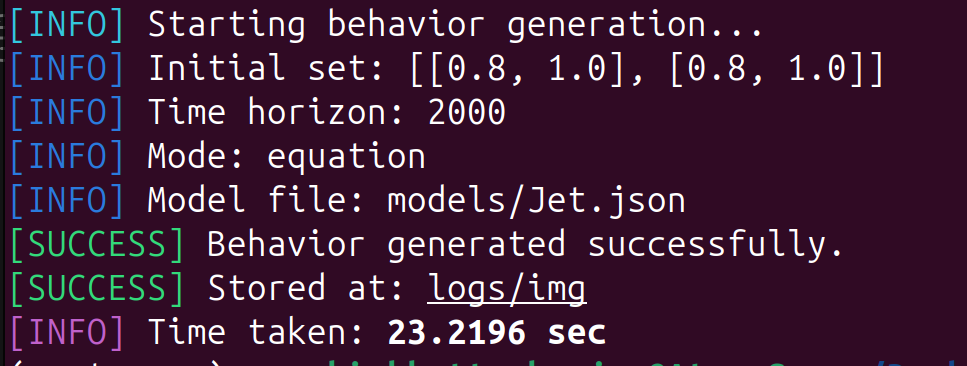
</p>

<p align="center">
  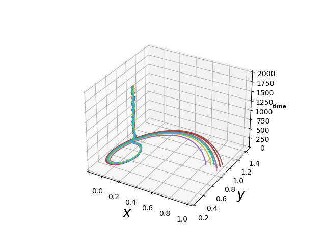
</p>

The plot above shows the resulting trajectories, each shown in a different color with $x$ and $y$ on the x- and y-axes and the time step on the z-axis. For models with more than two state variables, one plot is generated for each pair of states, so any pair can be inspected. The plots are saved in `logs/img`.

**Generate Log**

`checkSafety` requires a log of the system as an input. This log can can come from a real system or be generated by Posto with the `generateLog` command (Block 2 in the diagram above). It simulates one trajectory from a random initial state and records each time step with logging probability `prob` (in percent). Starting with the initial state, each recorded state $v$ is stored as the interval $[v - \delta_{log}, v + \delta_{log}]$, where $\delta_{log}$ is set by `dtlog`, giving a sparse and uncertain log similar to one recorded by a noisy sensor.

```bash
python posto.py generateLog --log=logs/Jet.lg --init="[[0.8, 1.0], [0.8, 1.0]]" --timestamp=2000 --mode=equation --model_path=models/Jet.json --prob=5 --dtlog=0.04
```

###### Example Results

<p align="center">
  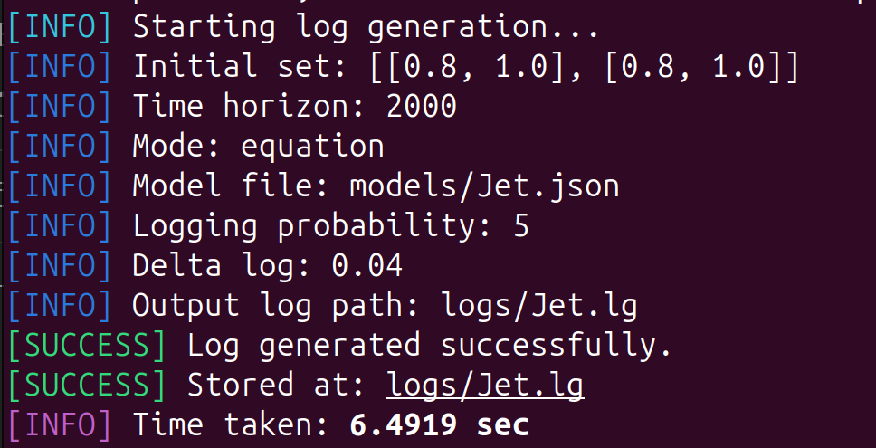
</p>

###### Log File Example 

Each line of the log stores a time step followed by one interval per state, in the order of `state_vars`:

<p align="center">
  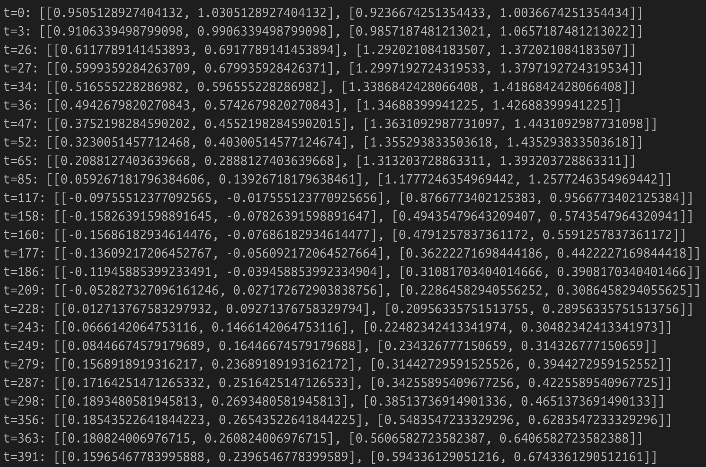
</p>
Posto also plots the log in 3D, with $x$ and $y$ on the horizontal axes and the time step on the vertical axis. In these plots, the boxes mark all log records and do not indicate safety

###### Without Trajectory Visualization

<p align="center">
  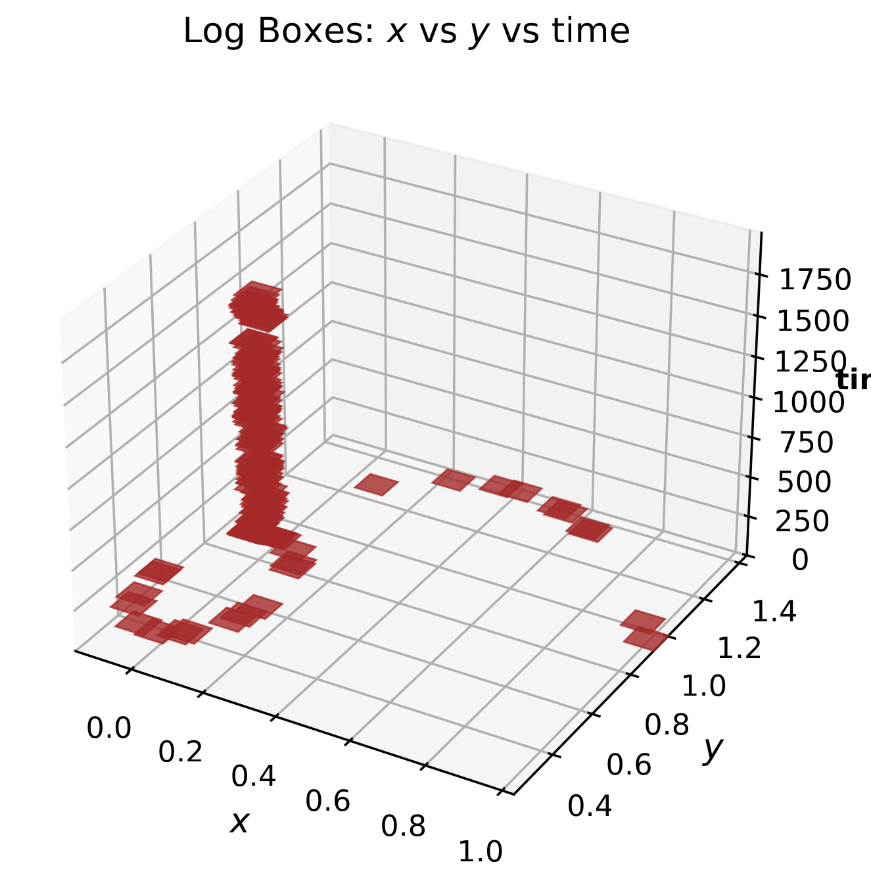
</p>
The plot shows the log records as brown boxes.


###### With Trajectory Visualization

<p align="center">
  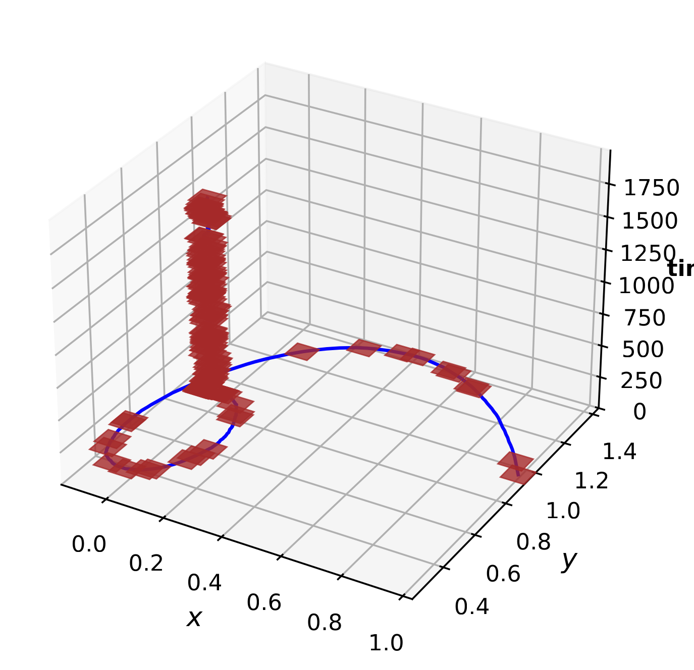
</p>

The blue curve in this plot shows the simulated trajectory from which the log has been recorded along with the records denoted with the brown boxes.

**Check Safety**

The `checkSafety` command takes the mode, the model and a log as inputs. It first checks every log record against the safety constraints. If the log is determined to be safe, it generates random trajectories (Block 1) keeping only the valid ones that pass through every record in the provided log and checks them against the constraints (Block 5). It stops at the first unsafe valid trajectory or infers the system to be safe once $K$ (obtained from Block 3) valid trajectories  are all found safe. During the run, Posto prints the number of generated and valid trajectories every 100 trajectories, followed by the time taken and the verdict.

The `--mode` argument tells Posto how the system model is provided. Two modes are available:

- `equation`: the model is a `.json` file like the one used in this example.
- `ann`: the model is a trained neural network provided as a `.h5` file. Since a `.h5` file does not store state names or safety constraints the following must also be provided:
  - `--states`: a comma-separated list of state names.
  - `--constraints`: the safety constraints, given either as an inline list or as a `.json` file.

For dynamics that require custom Python code, the **Development Mode** described below can also be used.

```bash
python posto.py checkSafety --log=logs/Jet.lg --mode=equation --model_path=models/Jet.json
```
Posto produces one plot per state variable, with the time step on the horizontal axis and the state value on the vertical axis. Black boxes are log records, and the red dashed horizontal line marks the threshold $-0.10$.

###### Example Results

##### SAFE

<p align="center">
  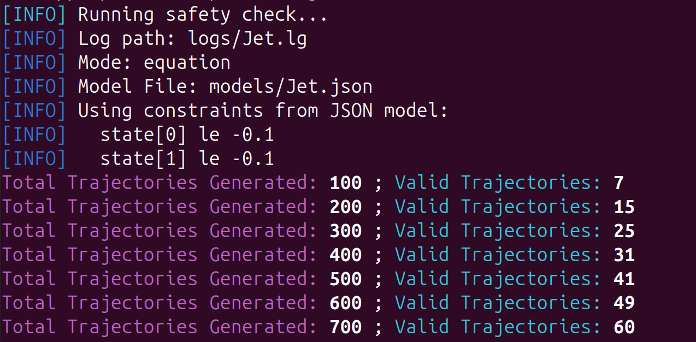
  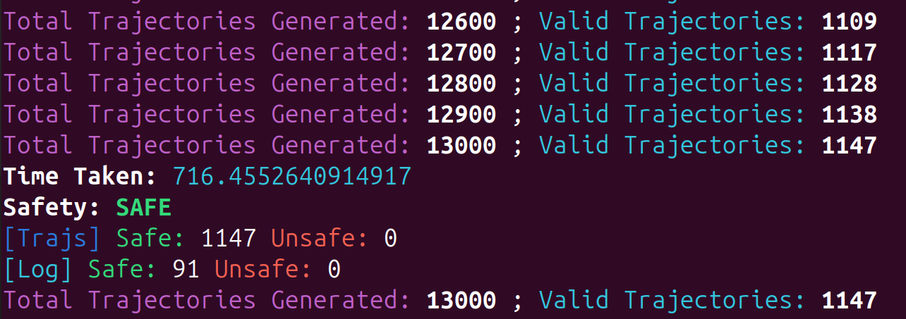
</p>
<p align="center">
  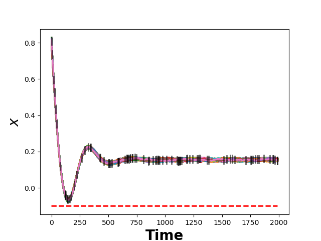
  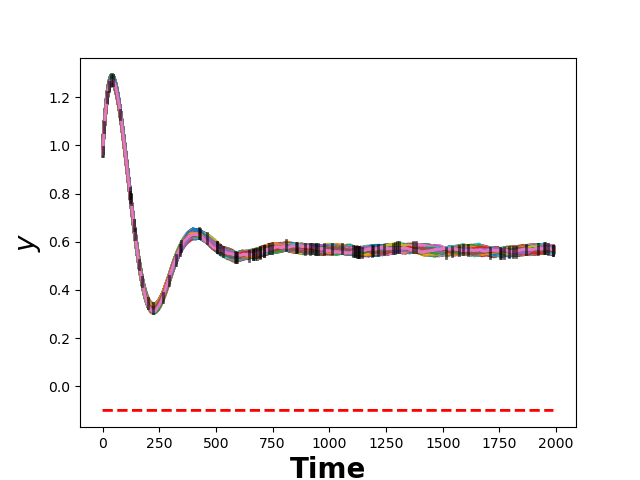
</p>


In the above plots, the colored lines are the valid trajectories, each passing through every record on the log and staying above the threshold. All 1,147 valid trajectories (out of 13,000 generated) are safe, so the system is inferred safe with confidence $c$.

##### UNSAFE LOG

<p align="center">
  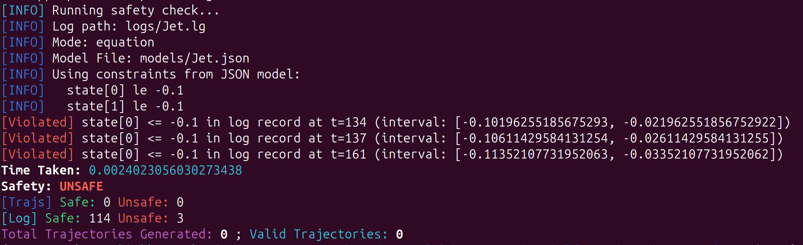
</p>
<p align="center">
  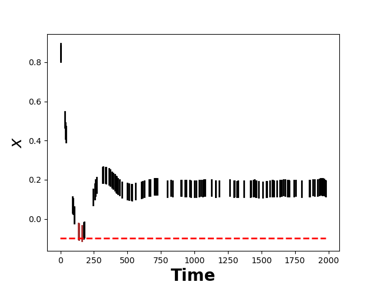
  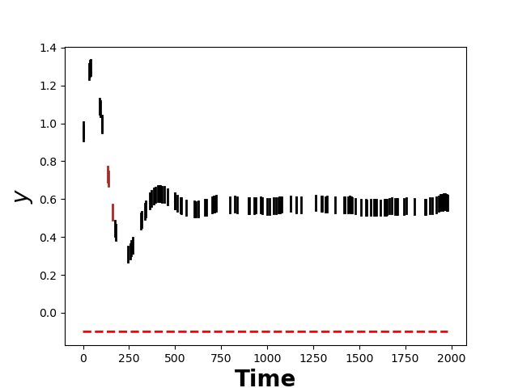
</p>

In this example, the system is inferred to be unsafe since $x$ intervals of 3 records in the log itself reach $-0.10$ (t = 134, 137, 161). As a result, no trajectories are generated. Brown boxes in the $x$ and $y$ plots are the unsafe log records while the black boxes are the safe log records. 

##### UNSAFE TRAJECTORY

<p align="center">
  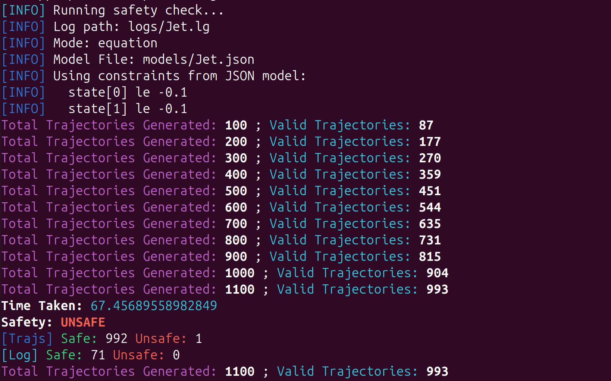
</p>


<p align="center">
  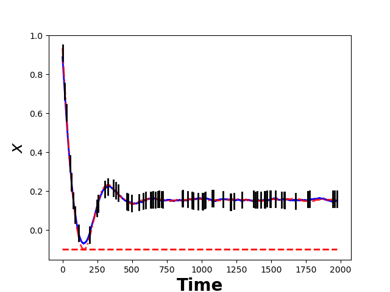
  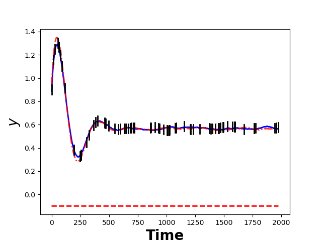
</p>
All log records are safe but a valid trajectory shown as the red dashed curve drops below $-0.10$ in $x$ near step 150 and is returned as a counterexample. The blue curve is a safe valid trajectory.

## Other Usage: Development Mode
Custom next‑state function without modifying core `Posto` code.

Example:
```python
from System import System

def my_getNextState(state):
    x, y = state
    x_next = x + 0.1 * (y - x)
    y_next = y + 0.1 * (x - y)
    return (x_next, y_next)

sys = System(
    log_path="/path/to/output.lg",
    states=["x", "y"],
    constraints=[(0, "le", 1)]
)

sys.getNextState = my_getNextState

sys.behaviour([[0, 1], [0, 1]], T=100)
sys.generateLog([[0, 1], [0, 1]], T=100, prob=0.5, dtlog=0.1)
sys.checkSafety()
```
Run the above using the command:

```bash
python dev/Model.py
```

Run the above using the command:

```bash
python dev/Model.py
```

## Required Packages

- `numpy`  
- `scipy`  
- `mpmath`  
- `matplotlib`  
- `docopt`  
- `tensorflow`  
- `tqdm`

Detailed installation and usage instructions are also available in the [User Guide](https://github.com/autmn-lab/posto_tool/blob/master/docs/User_Guide.md).
