# Posto: Probabilistic Safety Monitoring 

---

## System Dynamics and Constraints

Let the system state be

$$
s_t =
\begin{bmatrix}
x_t \\
y_t \\
z_t
\end{bmatrix},
$$

where $ (x_t, y_t, z_t) $ are the state variables at time \(t\).

### Constants

$$
\begin{aligned}
dt &= 0.01, \\
\alpha &= 2.0, \\
\beta &= 0.5, \\
\gamma &= 1.0.
\end{aligned}
$$

### Disturbance Ranges

$$
\begin{aligned}
\varepsilon_{x,t} &\in [-0.005,\,0.005], \\
\varepsilon_{y,t} &\in [-0.002,\,0.002], \\
\varepsilon_{z,t} &\in [-0.003,\,0.003].
\end{aligned}
$$

Each \($$ \varepsilon $$\) term is an independent bounded noise/uncertainty at time \(t\).

### Discrete-Time Dynamics

$$
\begin{aligned}
x_{t+1} &= x_t + dt\,(\alpha y_t - \beta x_t^3) + \varepsilon_{x,t}, \\
y_{t+1} &= y_t + dt\,(\beta x_t^2 - \gamma z_t) + \varepsilon_{y,t}, \\
z_{t+1} &= z_t + dt\,(x_t - y_t + \gamma z_t^2) + \varepsilon_{z,t}.
\end{aligned}
$$

### Constraints

The system is deemed unsafe if **any one** of the following conditions is **True**: 
$$
\begin{aligned}
x_t &\ge 5.74, \\
x_t &\le -10.0, \\
y_t &\le -8.0, \\
z_t &\ge 12.0, \\
z_t &\le -3.5.
\end{aligned}
$$

### JSON Representation

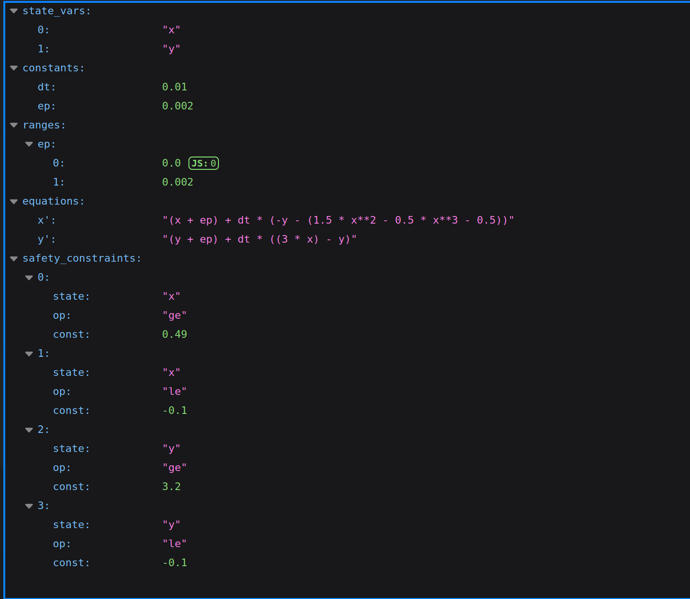

## System Behavior

```bash
python3 posto.py behavior --log=logs/model1.lg --init="[[-1.667370, -1.467370], [0.531417, 0.731417], [-1.678000, -1.478000]]" --timestamp=1000 --mode=equation 
--model_path=models/model1.json
```

| **Argument**                | **Description**                                              |
| --------------------------- | ------------------------------------------------------------ |
| `--log=<logfile>`           | **Path** used to determine the directory where generated plots and logs are saved. |
| `--init=<initialState>`     | **Initial state set** for log generation.<br>Must be provided in the format:<br>`"[x_min, x_max], [y_min, y_max]"` |
| `--timestamp=<timestamp>`   | **Time horizon** for the simulation (integer, ≥ 0).          |
| `--mode=<mode>`             | **Type of operation** used to generate logs or trajectories. Must be one of:<br>• `equation` — uses an equation-based model defined in a `.json` file.<br>• `ann` — uses an Artificial Neural Network model (`.h5` file). |
| `--model_path=<model_path>` | **Path** to the model file corresponding to the chosen mode:<br>• if `--mode=equation` → must point to a `.json` file containing the system equations.<br>• if `--mode=ann` → must point to a `.h5` file of the trained ANN model. |

> **Note:** All specified files must exist and be accessible.

#### Example Results

<p align="left">
  
</p>

<p align="center">
  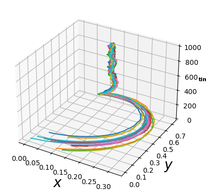
  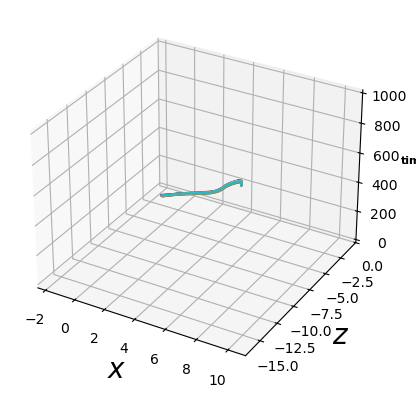
  
</p>


## Generate Log

```bash
python3 posto.py generateLog --log=logs/model1.lg --init="[[-2,1],[-1.6,0.8],[-2.4,1.2]]" --timestamp=500 --mode="equation" --model_path=models/model1.json 
--prob=5 --dtlog=0.1
```

| **Argument**                | **Description**                                              |
| --------------------------- | ------------------------------------------------------------ |
| `--log=<logfile>`           | **Path** used to determine the directory where generated plots and logs are saved. |
| `--init=<initialState>`     | **Initial state set** for log generation.<br>Must be provided in the format:<br>`"[x_min, x_max], [y_min, y_max]"` |
| `--timestamp=<timestamp>`   | **Time horizon** for the simulation (integer, ≥ 0).          |
| `--mode=<mode>`             | **Operation mode** used to generate logs or trajectories. Must be one of:<br>• `equation` — uses an equation-based model defined in a `.json` file.<br>• `ann` — uses an Artificial Neural Network model (`.h5` file). |
| `--model_path=<model_path>` | **Path** to the model file corresponding to the chosen mode:<br>• if `--mode=equation` → must point to a `.json` file containing the system equations.<br>• if `--mode=ann` → must point to a `.h5` file of the trained ANN model. |
| `--prob=<probability>`      | **Percentage of steps recorded** in the generated log (e.g., `30`, `50`, `100`). |
| `--dtlog=<step_interval>`   | **Time-step interval** between successive log entries. Controls log granularity and sampling frequency. |

> **Note:** All specified files must exist and be accessible.

#### Example Results

<p align="left">
  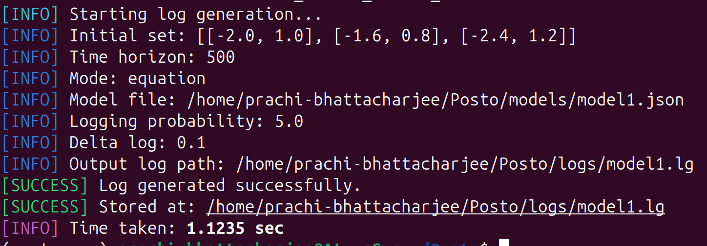
</p>

##### Log File Example 

<p align="left">
  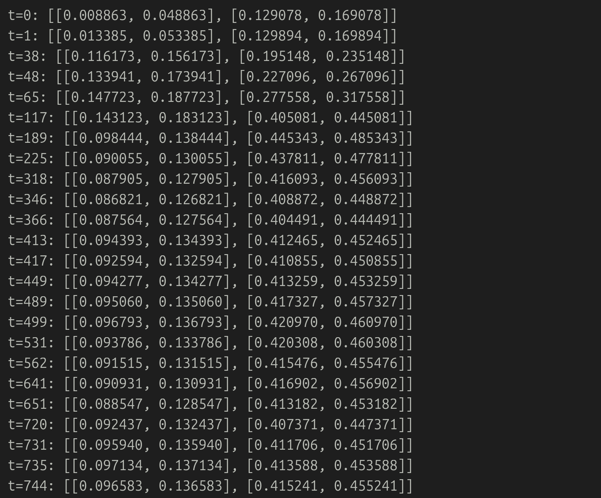
</p>

##### Without Trajectory Visualization

<p align="center">
  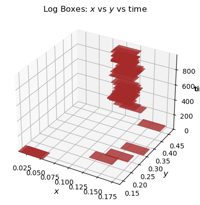
  
  
</p>

##### With Trajectory Visualization

<p align="center">
  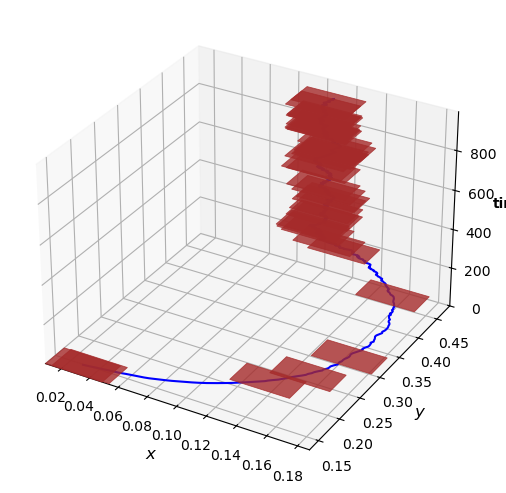
  
  
</p>


---

## Check Safety

```bash
python3 posto.py checkSafety --log=logs/model1.lg --mode=equation 
--model_path=models/model1.json
```

| **Argument**                | **Description**                                              |
| --------------------------- | ------------------------------------------------------------ |
| `--log=<logfile>`           | **Path** used to determine the directory where generated plots and logs are saved. |
| `--mode=<mode>`             | **Operation mode** used to generate logs or trajectories. Must be one of:<br>• `equation` — uses an equation-based model defined in a `.json` file.<br>• `ann` — uses an Artificial Neural Network model (`.h5` file). |
| `--model_path=<model_path>` | **Path** to the model file corresponding to the chosen mode:<br>• if `--mode=equation` → must point to a `.json` file containing the system equations.<br>• if `--mode=ann` → must point to a `.h5` file of the trained ANN model. |

> **Note:** All specified files must exist and be accessible.

#### Example Results

##### SAFE

<p align="left">
  
</p>

<p align="left">
  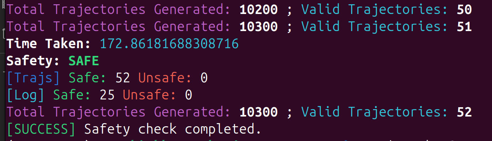
</p>

<p align="center">
  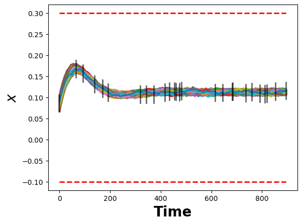
  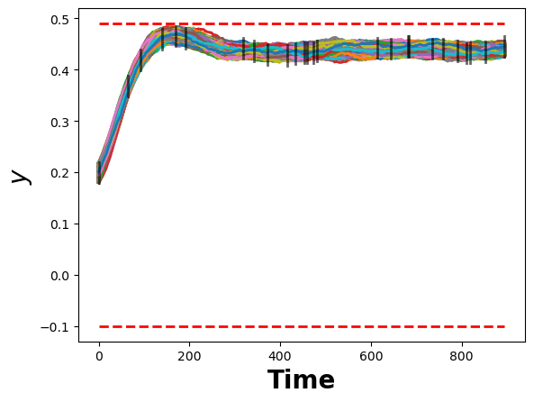
  
</p>

##### UNSAFE

<p align="left">
  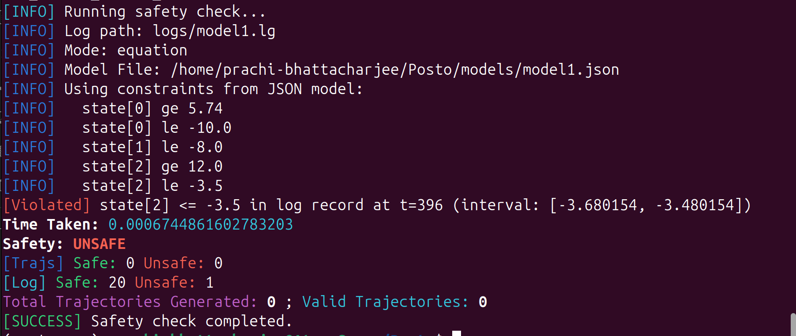
</p>

<p align="center">
  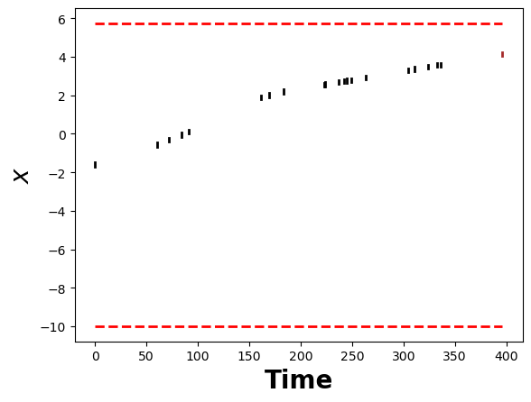
  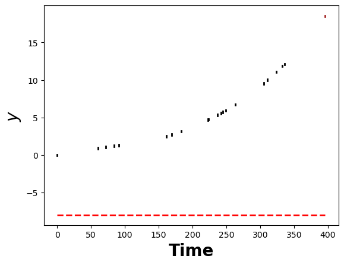
  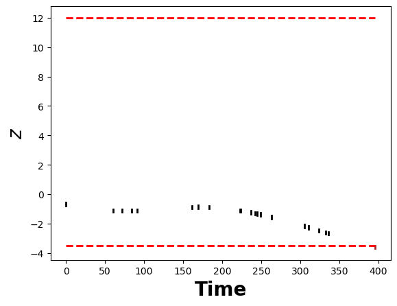
</p>

## Using `Model.py` for Custom Dynamics

The `Model.py` path lets us **override** the system’s next‑state map at runtime.

### Minimal custom model

**Model.py**

```python
import random
def my_getNextState(state):
    
    dt=0.01
    ep=0.002

    x_cur=copy.copy(state[0])
    y_cur=copy.copy(state[1])

    x_cur+=random.uniform(0,ep)
    y_cur+=random.uniform(0,ep)

    x_next=x_cur+(dt*(-y_cur-(1.5*(x_cur)-(0.5*(x_cur*x_cur))-0.5)))
    y_next=y_cur+(dt*((3*x_cur)-y_cur))

    nextState=(x_next,y_next)
    return nextState
```

**Use it with System**

```python
from System import System

# no mode/model_path: we'll inject our own getNextState() function, state names and constraints
my_states = ['x', 'y']
my_constraints = [(1, 'ge', 0.49)]
sys = System(log_path="/path/to/Posto/logs/custom_with_modelpy.lg",states=my_states, constraints=my_constraints)

# override the engine step
sys.getNextState = my_getNextState

# generate a log: init set must match state dimension (x, y)
init_box = [[0.0, 0.2], [0.0, 0.2]]
sys.behaviour(init_box, T=1000)
sys.generateLog(init_box, T=1000, prob=3, dtlog=0.01)
sys.checkSafety()
```

**Run**

```bash
python dev/Model.py
```

#### Results

##### Behavior

<p align="center">
  
</p>

##### Log Generation

<p align="center">
  
</p>

<p align="center">
  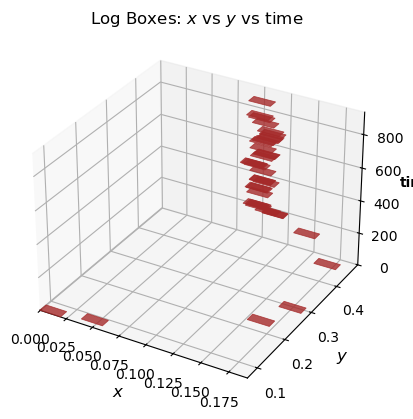
  
</p>

##### Safety Check

<p align="center">
  
</p>

<p align="center">
  
  
</p>

